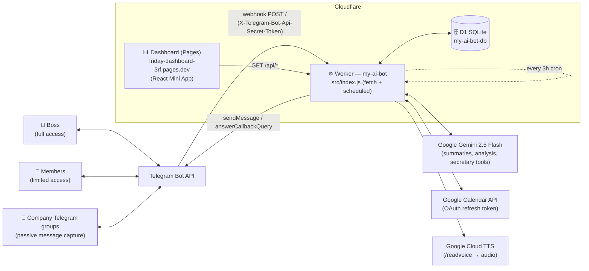
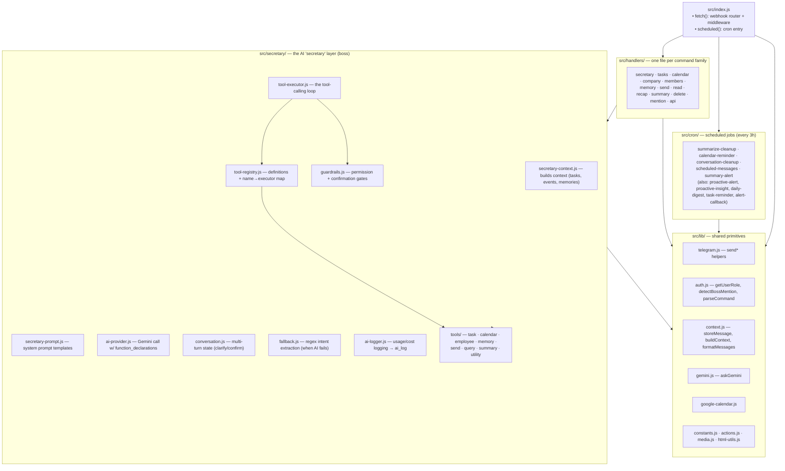
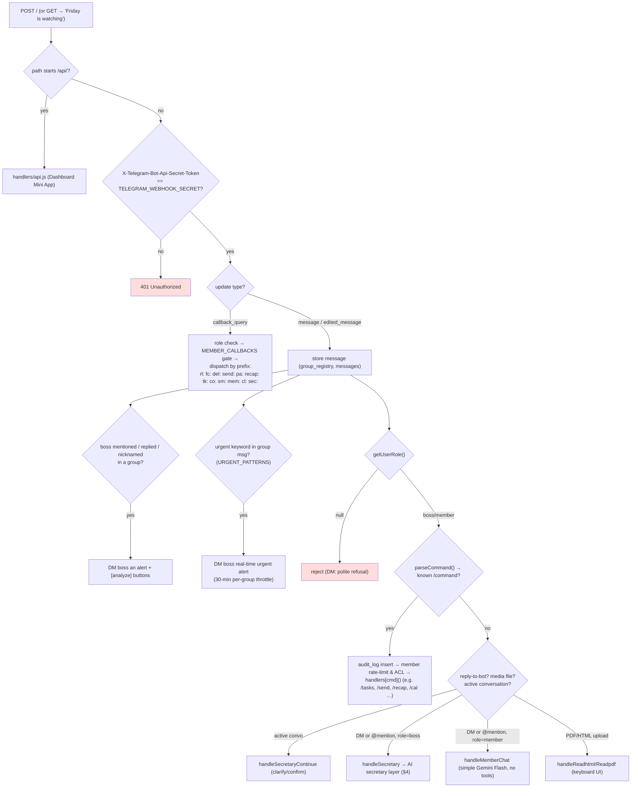
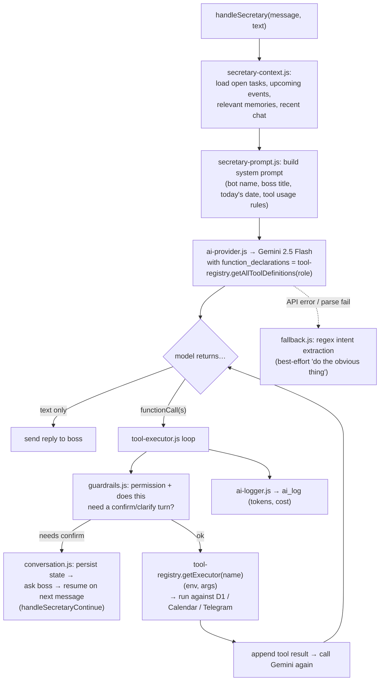
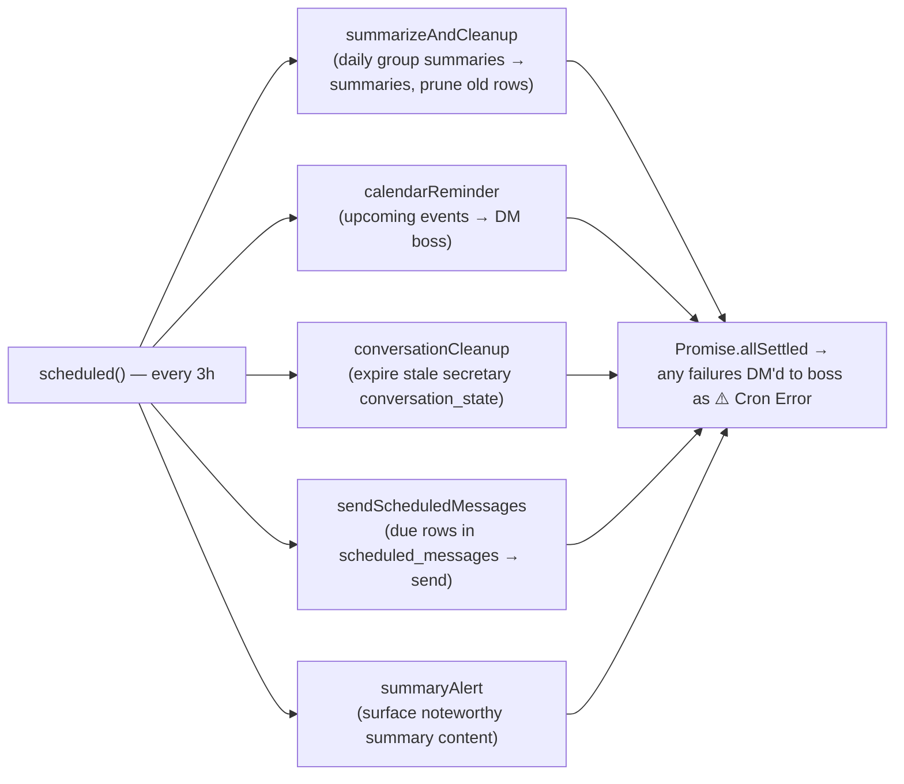
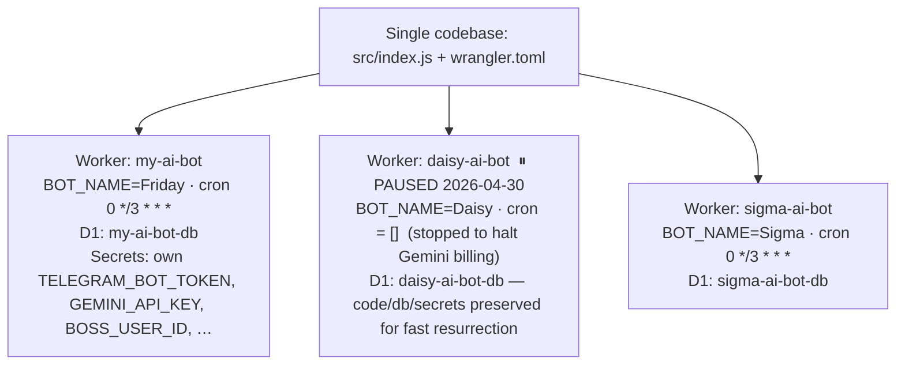

# F.R.I.D.A.Y — Architecture & Handoff Guide

> A private AI assistant ("external brain") for a small company, running entirely on **Cloudflare Workers**.
> It lives in Telegram: it remembers every message, watches groups for things the boss should know about,
> sends proactive alerts, manages tasks/calendar, and answers the boss via an AI "secretary" with tool-calling.
>
> One codebase serves **three independent bot instances** (Friday, Daisy, Sigma) via Wrangler environments.

**Read this first, then `docs/features.md` for the exhaustive feature/command reference.**

---

## 1. System context



| External dependency | Used for | Auth |
|---|---|---|
| Telegram Bot API | All messaging, inline keyboards, callbacks | `TELEGRAM_BOT_TOKEN` + webhook `secret_token` |
| Google Gemini 2.5 Flash | Daily summaries, proactive-alert analysis, secretary tool-calling | `GEMINI_API_KEY` |
| Google Calendar API | `/cal` commands, calendar reminders | OAuth: `GOOGLE_CLIENT_ID/SECRET` + `GOOGLE_CALENDAR_REFRESH_TOKEN` |
| Google Cloud TTS | `/readvoice` text→speech | `GOOGLE_TTS_API_KEY` |
| Cloudflare D1 | All persistent state | wrangler binding `DB` |
| Cloudflare Pages | The cost/tasks/alerts dashboard (separate deploy, hits `/api/*` on this Worker) | — |

---

## 2. Module map



---

## 3. Webhook request flow (`fetch`)

Every Telegram update hits `src/index.js → fetch()`:



Key middleware facts:

- **Webhook secret is mandatory.** If `TELEGRAM_WEBHOOK_SECRET` is unset the Worker returns `500` and accepts nothing. Compared with a constant-time `timingSafeEqual`.
- **Role-based access** (`src/lib/auth.js`, table `allowed_users`): `boss` (everything) · `member` (subset — see `MEMBER_COMMANDS` / `MEMBER_CALLBACKS` in `src/lib/constants.js`) · `null` (rejected). Boss is `BOSS_USER_ID`.
- Members get an in-memory rate limit (10 commands / 60s).
- Every command is written to `audit_log` (fire-and-forget).
- All long work runs via `ctx.waitUntil(...)` — the webhook returns `200 OK` immediately.
- Errors are caught at the top, DM'd to the boss as `⚠️ Worker Error`, and the triggering chat gets a polite apology.

---

## 4. The "secretary" AI layer (boss only)

When the boss DMs the bot or @-mentions it, `handlers/secretary.js → handleSecretary()` runs an agentic loop:



**Tool families** (`src/secretary/tools/*.js`, each exports `definitions` + `executors`):

| File | Tools | Boss-only? |
|---|---|---|
| `task-tools.js` | create / update / complete / block / list tasks, comments | no |
| `query-tools.js` | `ask_clarification`, `resolve_user`, `resolve_task` | no |
| `summary-tools.js` | `get_workspace_summary`, overdue, employee summary, **`list_groups`**, **`recap_group`** | no |
| `employee-tools.js` | add / list workspace members | no |
| `utility-tools.js` | `fetch_url`, `text_to_speech`, misc | no |
| `send-tools.js` | `send_message` (boss → group, with confirmation) | **yes** |
| `calendar-tools.js` | CRUD Google Calendar events | **yes** |
| `memory-tools.js` | save / delete long-term memories | **yes** |

`tool-registry.js` is the single place that wires a new tool in: import its `definitions`/`executors`, add to `getAllToolDefinitions()` (and the boss-only block if needed) and `allExecutors`.

Members never reach this layer — they get `handlers/mention.js → handleMemberChat()`, a plain Gemini Flash chat with no tools and no actions.

---

## 5. Cron jobs (`scheduled`, every 3 hours — `crons = ["0 */3 * * *"]`)



Other cron-style modules in `src/cron/` (`proactive-alert.js`, `proactive-insight.js`, `daily-digest.js`, `task-reminder.js`, `alert-callback.js`) implement the proactive-alert engine and the `pa:` button callbacks; they're invoked from the jobs above / from webhook callbacks rather than being separate cron triggers.

The **proactive-alert engine**: scans recent group messages, asks Gemini to emit structured JSON alerts (urgency `critical|high|medium|low`, dedup by `topic_fingerprint`), stores them in `alerts`, and DMs the boss with `📋 วิเคราะห์สั้น / 📝 ละเอียด / ✅ จัดการแล้ว / ❌ ไม่สำคัญ` buttons (`callback_data = pa:<mode>:<chatId>:<alertId>`). Boss feedback is fed back as a learning signal.

---

## 6. Data model (D1 — `migrations/0001…0028`)

```mermaid
erDiagram
    messages {
        int chat_id
        int message_id
        text message_text
        text first_name
        text username
        text chat_title
        text created_at
    }
    group_registry {
        int chat_id PK
        text chat_title
        int is_active
        text last_message_at
    }
    summaries {
        int chat_id
        text summary_date
        text summary_text
    }
    alerts {
        text alert_hash PK
        int chat_id
        text urgency
        text category
        text topic_fingerprint
        text status
    }
    memories {
        int id PK
        text content
        int priority
        text last_accessed
    }
    tasks {
        int id PK
        text title
        text status
        text priority
        text assignee
        text due_on
    }
    task_comments }o--|| tasks : "on"
    task_blockers }o--|| tasks : "blocks"
    workspace_members ||--o{ tasks : "assigned"
    allowed_users {
        int user_id PK
        text role
    }
    conversation_state {
        int chat_id
        int user_id
        text state
        text payload
    }
    ai_log {
        text model
        int tokens_in
        int tokens_out
        real cost
    }
    audit_log {
        int user_id
        text command
        text args
        text role
    }
    companies ||--o{ messages : "tags (group→company)"
    calendar_tokens ||--o{ calendar_reminders : "drives"
    scheduled_messages
    bot_messages
    file_cache
    readlink_cache
    pending_sends
    commitments
```



Full table list: `messages`, `patterns`, `memories`, `summaries`, `file_cache`, `bot_messages`, `alerts`, `tasks`, `task_comments`, `task_blockers`, `allowed_users`, `readlink_cache`, `companies`, `pending_sends`, `calendar_tokens`, `calendar_reminders`, `workspace_members`, `conversation_state`, `ai_log`, `scheduled_messages`, `audit_log`, `commitments`, `group_registry`.

Migrations are append-only; apply with `npm run db:migrate` (local: `db:migrate:local`). CI applies `--remote` migrations for all three DBs on every push to `main`.

---

## 7. Multi-instance (Friday / Daisy / Sigma)



- Per-instance config lives in `[env.daisy]` / `[env.sigma]` in `wrangler.toml` (`vars` for non-secrets; **secrets are set per-env via `wrangler secret put … --env daisy`**).
- `BOT_NAME` replaces every hardcoded "Friday"; `BOSS_NICKNAMES` (JSON array) feeds `detectBossMention`; `BOSS_TITLE` ("นาย"/"คุณ") tunes the secretary's address form.
- To resurrect Daisy: restore `crons = ["0 */3 * * *"]` under `[env.daisy.triggers]`, `npm run deploy:daisy`, then re-`setWebhook` with the secret token (recipe is in the comment block in `wrangler.toml`).

---

## 8. Configuration — env vars & secrets

**Non-secret `vars`** (in `wrangler.toml`, per env): `DASHBOARD_URL`, `WORKER_URL`, `BOT_NAME`, `BOT_USERNAME`, `BOSS_USERNAME`, `BOSS_TITLE`, `BOSS_NICKNAMES`, `GEMINI_MODEL`, `GEMINI_FALLBACK_MODEL`, `GEMINI_TEMPERATURE`, `GEMINI_MAX_RETRIES`, `GOOGLE_CALENDAR_ID`.

**Secrets** (set via `wrangler secret put <NAME>` — never commit; per-env for daisy/sigma):

| Secret | Purpose |
|---|---|
| `TELEGRAM_BOT_TOKEN` | Telegram Bot API token |
| `TELEGRAM_WEBHOOK_SECRET` | Shared secret echoed in `X-Telegram-Bot-Api-Secret-Token`; **without it the Worker rejects everything** |
| `BOSS_USER_ID` | Telegram user id of the boss (the only `boss` role) |
| `GEMINI_API_KEY` | Google Gemini API key |
| `GOOGLE_CLIENT_ID`, `GOOGLE_CLIENT_SECRET`, `GOOGLE_CALENDAR_REFRESH_TOKEN` | Google Calendar OAuth (token bootstrap helper: `scripts/google-auth.js`) |
| `GOOGLE_TTS_API_KEY` | Google Cloud Text-to-Speech (`/readvoice`) |

> ⚠️ This repo is **public**. Keep all of the above as wrangler secrets only. There's a `dashboard/.env` in the working tree — it's gitignored; double-check before any `git add`.

---

## 9. Local dev, test, deploy

```bash
npm install

# Local dev (uses local D1)
npm run dev                 # Friday   |  npm run dev:daisy  |  npm run dev:sigma
npm run db:migrate:local    # apply migrations to local D1

# Tests + syntax (CI runs both on every push to main)
npm test                    # vitest run  (tests/: auth, constants, context, html-utils)
node -c src/index.js        # quick syntax check of a module

# Deploy (CI does this automatically on push to main — see below)
npm run deploy              # Friday   |  deploy:daisy  |  deploy:sigma  |  deploy:all
npm run db:migrate          # remote D1 migrate (db:migrate:all for all three)

# Logs
npm run tail                # wrangler tail  (tail:daisy / tail:sigma)
```

**CI/CD — `.github/workflows/deploy.yml`:** every push to `main` →
`npm install` → syntax-check all `src/**/*.js` → `vitest run` → `wrangler d1 migrations apply --remote` for **all 3 DBs** → `wrangler deploy` for **all 3 Workers**.
So **pushing to `main` is a production deploy of all instances.** `CLOUDFLARE_API_TOKEN` is a GitHub Actions secret.

**First-time webhook registration** (or after changing the secret):
```bash
curl -X POST "https://api.telegram.org/bot<BOT_TOKEN>/setWebhook" \
  --data-urlencode "url=https://my-ai-bot.friday-bot.workers.dev/" \
  --data-urlencode "secret_token=<TELEGRAM_WEBHOOK_SECRET value>"
```

---

## 10. Where to start (new maintainer checklist)

1. **`src/index.js`** — the whole control flow is here (router + cron). ~570 lines, read it top to bottom.
2. **`src/lib/auth.js`** + **`src/lib/constants.js`** — roles, `MEMBER_COMMANDS/CALLBACKS`, command parsing, boss-mention detection.
3. **`docs/features.md`** — exhaustive command list & per-feature notes.
4. **`src/secretary/tool-executor.js`** + **`tool-registry.js`** — how the AI does things; add new capabilities here.
5. **`wrangler.toml`** — the three instances and all non-secret config; secrets via `wrangler secret list`.
6. Run `npm test` and `npm run dev` to confirm your environment, then `wrangler secret put …` the secrets for whichever instance you're operating.

Adding a feature, typical path: new migration in `migrations/` → new handler in `src/handlers/` (or new tool in `src/secretary/tools/`) → wire into `src/index.js` `handlers{}` map / callback prefixes (or into `tool-registry.js`) → `node -c` + `npm test` → push to `main`.
