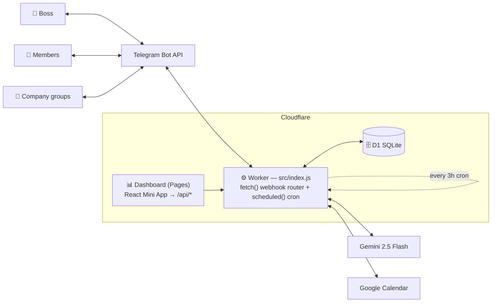

# F.R.I.D.A.Y

A private AI assistant ("external brain") for a small company — runs entirely on **Cloudflare Workers**, lives in **Telegram**.
It captures every message in the company's groups, watches for things the boss should know about, sends proactive
alerts, manages tasks & calendar, and answers the boss through an AI "secretary" with tool-calling.

One codebase serves **three independent bot instances** — Friday, Daisy *(paused)*, Sigma — via Wrangler environments.



```
src/
├── index.js          # webhook router + cron entry — read this first
├── lib/              # telegram, auth (roles), context (message store), gemini, google-calendar, constants …
├── handlers/         # one file per command family — secretary, tasks, calendar, send, read, recap, summary, members, memory, company, api …
├── secretary/        # boss-only AI layer: context → Gemini w/ tools → tool-executor loop → guardrails → conversation state
│   └── tools/        # task · calendar · employee · memory · send · query · summary · utility  (each: definitions + executors)
└── cron/             # scheduled jobs (every 3h) + proactive-alert engine
migrations/           # D1 schema, append-only (0001 … 0028)
dashboard/            # Vite + React Mini App (separate Pages deploy; talks to this Worker's /api/*)
docs/features.md      # exhaustive command & feature reference
```

## 📐 Architecture & handoff guide

**[ARCHITECTURE.md](./ARCHITECTURE.md)** — full diagrams (system context, module map, webhook flow, secretary tool-calling loop,
cron jobs, data model, multi-instance), env/secret reference, and a "where to start" checklist for a new maintainer.

## Quick start

```bash
npm install
npm run dev                 # local Friday (uses local D1) — dev:daisy / dev:sigma for the others
npm run db:migrate:local    # apply migrations to local D1
npm test                    # vitest (also runs in CI)

# secrets (never committed) — set per instance:
wrangler secret put TELEGRAM_BOT_TOKEN
wrangler secret put TELEGRAM_WEBHOOK_SECRET
wrangler secret put BOSS_USER_ID
wrangler secret put GEMINI_API_KEY
wrangler secret put GOOGLE_CLIENT_ID
wrangler secret put GOOGLE_CLIENT_SECRET
wrangler secret put GOOGLE_CALENDAR_REFRESH_TOKEN
wrangler secret put GOOGLE_TTS_API_KEY
```

Register the Telegram webhook (also after rotating the secret):

```bash
curl -X POST "https://api.telegram.org/bot<BOT_TOKEN>/setWebhook" \
  --data-urlencode "url=https://my-ai-bot.friday-bot.workers.dev/" \
  --data-urlencode "secret_token=<TELEGRAM_WEBHOOK_SECRET value>"
```

## Deploy

`.github/workflows/deploy.yml` deploys on every push to `main`: syntax-check → `vitest` → `wrangler d1 migrations apply --remote`
→ `wrangler deploy` — **for all three Workers (Friday, Daisy, Sigma)**. So **pushing to `main` ships to production.**

Manual: `npm run deploy` (`deploy:daisy`, `deploy:sigma`, `deploy:all`) · migrations `npm run db:migrate` (`db:migrate:all`) · logs `npm run tail`.

> ⚠️ This repo is **public** — every credential (`TELEGRAM_BOT_TOKEN`, `TELEGRAM_WEBHOOK_SECRET`, `BOSS_USER_ID`, `GEMINI_API_KEY`,
> Google OAuth, TTS key) must live only as wrangler secrets, never in the repo. Non-secret config (`BOT_NAME`, `BOSS_NICKNAMES`,
> `GEMINI_MODEL`, …) is in `wrangler.toml`. There's a gitignored `dashboard/.env` in the tree — check before `git add`.
